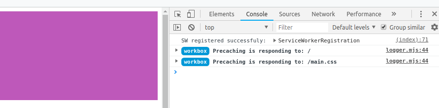

# Evaluate News article's sentiments

## Scope

- Use Aylien NLP API to read website content and provide basic sentiments like Opinion/Factbased, Postive/Neutral, etc.
- Build simple web interface using Node/Express and powerup using Webpack, Jest, and other tools.

## Run project

Below shows how to run in development and production mode.

### install the dependencies uses package.json to init

```
$ npm install
```

### run in development mode

To start the webpack dev server at port 8080

```
$ npm run build-dev
```

### run in production mode

Generate the dist files and then start server at port 3000

```
$ npm run build-prod

$ npm run start
```

## Configs

1. Setup environment based webpack config files:

   - Development : `webpack.config.dev.js`
   - Production : `webpack.config.prod.js`

2. Manage dependencies using `package.json` file.

## API

The project uses the Text Analysis SDKs from [aylien](https://aylien.com/text-api/sdks/), which provides a powerful and flexible AI-driven content analysis solutions.

## Offline Functionality

The project have service workers set up in webpack to provide the offline functionality of our app. When the service worker is functioning correctly, you will see the below message when you inspect the browser.



## Testing

Testing is done using Jest. To run test, use the command

```
npm run test
```
